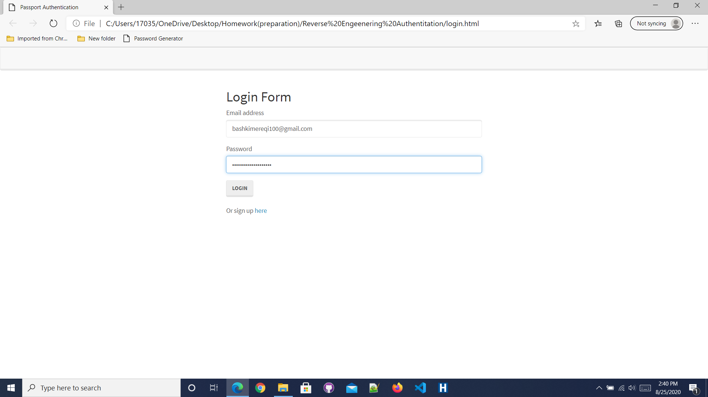

# homework-fourteen
Reverse Engineering Authentication

This app allows users to create an account, log into the account and sign back out securely. All user data is stored in a mysql database.
[
https://www.youtube.com/watch?v=7v7UaMsgg_c

